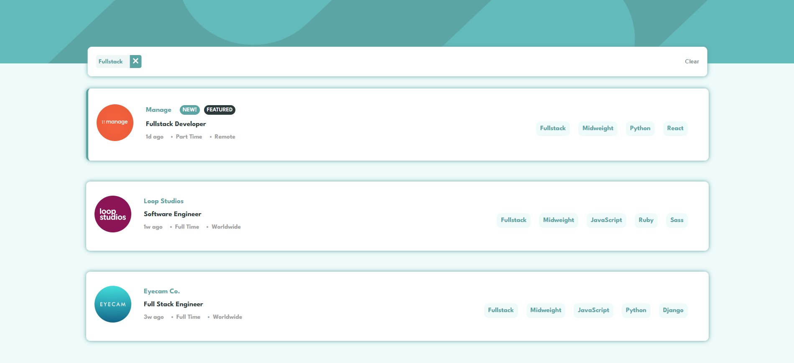

# Frontend Mentor - Job listings with filtering solution

This is a solution to the [Job listings with filtering challenge on Frontend Mentor](https://www.frontendmentor.io/challenges/job-listings-with-filtering-ivstIPCt). Frontend Mentor challenges help you improve your coding skills by building realistic projects. 

## Table of contents

- [Overview](#overview)
  - [The challenge](#the-challenge)
  - [Screenshot](#screenshot)
  - [Links](#links)
- [My process](#my-process)
  - [Built with](#built-with)
  - [What I learned](#what-i-learned)
  - [Continued development](#continued-development)
- [Author](#author)
## Overview

### The challenge

Users should be able to:

- View the optimal layout for the site depending on their device's screen size
- See hover states for all interactive elements on the page
- Filter job listings based on the categories

### Screenshot



### Links

- Solution URL: [Github](https://github.com/Diego2Drm/static-job-listinings-master)
- Live Site URL: [static-job-listinings-master](https://diego2drm.github.io/static-job-listinings-master/)

## My process

### Built with

- Semantic HTML5 markup
- CSS custom properties
- Flexbox
- Mobile-first workflow
- [React](https://reactjs.org/) - JS library
- [Redux-Toolkit](https://redux-toolkit.js.org/introduction/getting-started) - React Tool
- [Styled Components](https://styled-components.com/) - For styles


### What I learned
 I learned the steps for implementing redux tollkit 

```js
import { configureStore } from "@reduxjs/toolkit";
import filterReducer from "../features/filter/filterSlice"

export const store = configureStore({
  reducer: {
    filter: filterReducer,
  },
})
```
```js
import { createSlice } from "@reduxjs/toolkit";
// import data from "../../data.json"

const initialState = {
  data: [],
  filtered: [],
  original: [],
}

export const filterSlice = createSlice({
  name: "filter",
  initialState,
  reducers: {
    setData: (state, action) => {
      state.data = action.payload;
      state.filtered = action.payload;
      state.original = action.payload;
    },
    // filterRole: (state, action) => {
    //   state.original = state.data;
    //   state.filtered = state.data.filter(item => item.role === action.payload)
    // },
    applyFilters: (state, action) => {
      const filters = action.payload;

      state.filtered = state.data.filter(item => {
        const matchRole = filters.role ? item.role === filters.role : true;
        const matchLevel = filters.level ? item.level === filters.level : true;
        const matchLanguages = filters.languages
          ? filters.languages.every(lang => item.languages.includes(lang))
          : true;
        const matchTools = filters.tools
          ? filters.tools.every(tool => item.tools.includes(tool))
          : true;

        return matchRole && matchLevel && matchLanguages && matchTools;
      });
    },
    removeFilter: (state) => {
      state.filtered = state.original
    }
  },
});

export const { setData,  removeFilter, applyFilters } = filterSlice.actions;

export default filterSlice.reducer;

```

### Continued development

- [Redux-Toolkit](https://redux-toolkit.js.org/introduction/getting-started) - React Tool

## Author

- Website - [Diego Ramírez](https://diego2drm.github.io/Portafolio/)
- Frontend Mentor - [@Diego2Drm](https://www.frontendmentor.io/profile/Diego2Drm)
- Gmail - [diego.ramirez2d03@gmail.com]